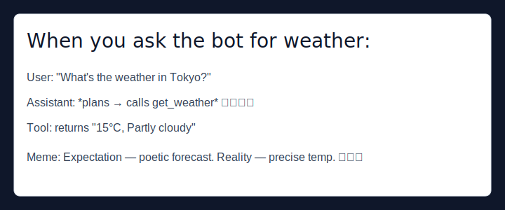

# Chat Weather — Beginner Tutorial

This small Python project runs a chat-style assistant that can fetch current weather for a city using a simple tool. It's designed for beginners: clone, install, set one environment variable, and run.

## What this project does
- `chat_wheather.py` implements a minimal chat loop that uses a language model (via Groq client) to plan actions and call a local tool `get_weather`.
- The `get_weather` tool queries wttr.in to return the current temperature and description for a given city.

## Prerequisites
- Python 3.10 or newer
- Internet access (for wttr.in and model API)
- A Groq API key if you want to run the model-driven loop (optional for testing the weather tool only)

## Files
- [chat_wheather.py](chat_wheather.py#L1-L111): main script — chat loop, tool registry, and Groq client usage.
- `requirements.txt`: Python dependencies used by the project.

## Setup (Windows)
1. Create and activate a virtual environment:

```powershell
python -m venv venv
.\venv\Scripts\Activate
```

2. Install dependencies:

```powershell
pip install -r requirements.txt
```

3. Create a `.env` file in the project root and add your Groq API key (if you plan to run the model-driven loop):

```
GROQ_API_KEY=your_groq_api_key_here
```

If you don't have a Groq key, you can still test the weather tool directly (see below).

## Running the project

Run the chat loop:

```powershell
python chat_wheather.py
```

The script prompts with `> ` — type a natural language request such as:

```
What is the weather in New York?
```

The assistant will plan, choose the `get_weather` action, call the tool, observe the result, and finally print a user-friendly output.

## Using the weather tool directly (no model required)
If you just want to test the `get_weather` function without the model, open a short Python snippet or interactive shell in the project directory:

```python
from chat_wheather import get_weather
print(get_weather('London'))
```

This calls `wttr.in` and prints something like `7°C, Partly cloudy`.

## Notes & troubleshooting
- If requests to `wttr.in` fail, verify your network and that the URL `https://wttr.in/<city>?format=j1` is reachable.
- If the Groq model call fails, check your `GROQ_API_KEY` and that you have internet access.
- Use Python virtual environments to avoid dependency conflicts.

## Extending the project (ideas)
- Add more tools (e.g., `get_forecast`, `get_timezone`) and register them in `available_tool` in `chat_wheather.py`.
- Replace the model client with a local fallback or mock for offline testing.
- Add unit tests for `get_weather` using recorded wttr.in responses.

## Contributing
Feel free to open issues or make pull requests to improve documentation, add tests, or add functionality.

---
Created as a beginner-friendly guide so anyone can run and explore the project quickly.

## Design (diagram)
Below is a simple design diagram that shows how the pieces interact: the user asks the assistant, the assistant plans and calls the `get_weather` tool, and the tool fetches data from `wttr.in`.


## Meme example
Just for fun — a small meme-style example that shows the expected flow and a light-hearted caption.



